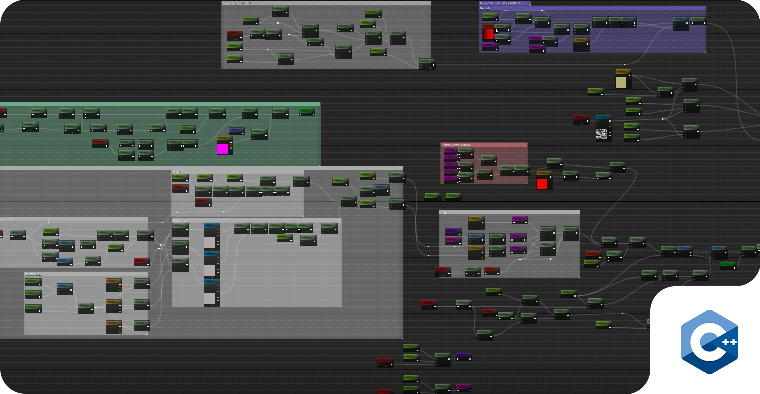

     
    <h1>Grass Simulation Material for Unreal Engine</h1>
    

        <b>Optimizing grass rendering in large environments</b>
    

     
    
     

## Description

This project presents a highly optimized material in Unreal Engine, developed using C++. The primary function of this material is to simulate grass in expansive environments without sacrificing performance. Inspired by the efficient methods used in **Ghost of Tsushima**, my implementation can dynamically simulate a staggering number of blades of grass—up to **8 million**, compared to the typical range of **8,000 to 16,000**.

## Features

- **Bezier Curve Control**: Utilizes the mathematical principles of Bezier curves to dynamically control the appearance and movement of grass blades.  
  - **What is a Bezier Curve?**: A Bezier curve is a parametric curve frequently used in computer graphics to model smooth curves. It is defined by a set of control points, allowing for easy manipulation of the curve's shape and characteristics.

**Linear Bézier curves**
Given distinct points P0 and P1, a linear Bézier curve is simply a line between those two points. The curve is given by

     
    
     

This is the simplest and is equivalent to linear interpolation. The quantity 𝑃1−𝑃0 represents the displacement vector from the start point to the end point.

- **Compute Shader and GPU Instancing**: Implements compute shaders for efficient blade generation and utilizes GPU instancing to maintain stable frame rates while rendering large amounts of grass.

- **Wind Map with Vertex Animation**: Adds realistic movement to the grass through a wind map that animates the vertices, enhancing the immersion of the environment.

- **Culling Techniques**: 
  - **Distance Culling**: Removes grass blades that are beyond a specified distance from the camera.
  - **Frustum Culling**: Only renders grass blades that are within the camera's view, optimizing performance.
  - **Occlusion Culling**: Prevents rendering of grass that is occluded by other objects, further improving efficiency.

- **Procedural Terrain Generation**: Generates terrain meshes procedurally using height maps, allowing for diverse and intricate landscapes.

     
    
     

## Notes

This project was developed for teaching purposes in C++ and Unreal Engine.

## Author

Marcelo Bensabath

## License

See LICENSE.

## Contact

If you have any questions and want to get in touch with me, just [send me an email](mailto:marcelob465@gmail.com).
