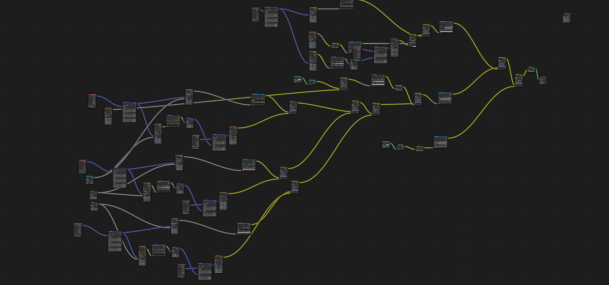

<div align="center">
    <br>
    <h1>Understanding the Logic of Blender's Material Node Editor</h1>
    <p>
        <b>Bridging visual design and programming logic</b>
    </p>
    <br>
    
    <br>
</div>

## Logic of the Node Editor

The Material Node Editor in Blender operates on a visual programming paradigm, where each node acts as a building block of logic. This system allows users to manipulate and connect nodes to create complex materials, resembling how code functions in traditional programming.

### Key Components of Node Logic

1. **Nodes as Functions**: Each node performs a specific operation (e.g., color adjustment, texture mapping). These can be thought of as functions in programming, where inputs are processed to produce an output.

2. **Data Flow**: The connections between nodes represent the flow of data, similar to how variables are passed between functions in code. The output of one node can serve as the input for another, allowing for intricate combinations of effects.

3. **Conditional Logic**: Some nodes incorporate conditional logic (like math operations), allowing users to set conditions for how inputs are processed, akin to control structures (if-else statements) in programming.

4. **Grouping and Reusability**: Just as functions can be defined and reused in code, nodes can be grouped into custom nodes, enabling a modular approach that simplifies complex material setups.

## Converting Node Logic to Code

1. **Identify Node Functions**: Each node corresponds to a specific function in code. For example, a color mix node can be translated to a function that blends two color values.

2. **Data Passing**: In code, you’ll define variables for each node's inputs and outputs. This resembles how you pass parameters to functions in programming.

3. **Flow Control**: Translate the connections between nodes into the sequence of function calls in your code. The output from one function (node) becomes the input for the next.

4. **Conditional Statements**: Any conditional logic within nodes can be expressed using if-else statements in code.

### Example Conversion

**Node Logic**:
- A Color Mix Node takes two color inputs and blends them based on a factor.

**Pseudocode**:
```python
def mix_colors(color1, color2, factor):
    return color1 * (1 - factor) + color2 * factor

output_color = mix_colors(input_color1, input_color2, mix_factor)
```

## Converting Code Back to Node Logic

1. **Function Breakdown**: Identify distinct functions in your code that could be represented as nodes.

2. **Visual Representation**: Create nodes for each function and define inputs and outputs based on the function’s parameters and return values.

3. **Connect Nodes**: Establish connections based on the order of operations in your code.

4. **Optimize with Conditions**: Incorporate any conditional logic as necessary using the appropriate nodes in the editor.

By understanding the relationship between nodes and programming logic, artists can leverage Blender's Material Node Editor to create powerful, dynamic materials while being able to translate that logic into traditional code for deeper customizations and enhancements.

<div align="center"> <br> <h1>Exploring Blender's Material Node Complexity</h1> <p> <b>Nodes</b> </p> <br>  <br> </div>
Step 1: Starting Simple
In this first step, we showcase a simplified Blender node graph. At this stage, most functions are grouped together, making the material look straightforward and easy to understand. This is an excellent starting point for beginners, allowing you to grasp the basic concepts of how nodes interact without getting overwhelmed.

<div align="center"> <br>  <br> </div>
Step 2: Diving Deeper
Next, we reveal one of the subgroups within the initial node graph. Here, you'll see more complex interactions between nodes that enhance the material's properties. By understanding how these nodes work together, you can start to appreciate the depth and versatility that the node system offers. Each connection adds a layer of detail, showcasing how your material can evolve into something truly unique and dynamic.

<div align="center"> <br>  <br> </div>
Step 3: Embracing Complexity
Finally, we present the complete node graph, which features a vast array of interconnected nodes. This intricate setup illustrates the limitless possibilities that come with mastering Blender's Material Node Editor. Each node contributes to the overall material, and as you continue to experiment and learn, you'll find that you can create exceptionally detailed and sophisticated materials. The complexity is only constrained by your creativity and understanding of how nodes can work together.


<div align="center"> <br>  <br> </div>

## Notes

This project was developed for teaching purposes in Blender.

## Author

Marcelo Bensabath

## License

See LICENSE.

## Contact

If you have any questions and want to get in touch with me, just [send me an email](mailto:marcelob465@gmail.com).