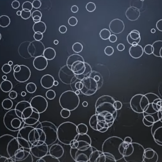

<div align="center">
    <br>
    <h1>RippleEffect Shader</h1>
    <p>
        <b>A dynamic shader for creating ripple effects on textures</b>
    </p>
    <br>
    
    <br>
</div>

## Description

The RippleEffect shader is a custom pixel shader designed to create realistic ripple effects on textures. Utilizing HLSL helper functions, this shader samples an input texture in a unique way, generating dynamic visual effects based on parameters such as frequency, phase, and amplitude. This shader is particularly useful for adding depth and movement to UI elements or backgrounds.

## How It Works

### Shader Setup

The shader begins by defining essential constants and configurations:

- **Input Count**: The shader takes one input texture.
- **Complex Sampling**: The shader samples the texture in a complex manner, allowing for more intricate effects.
- **Scene Position Requirement**: The shader needs access to scene position data for accurate calculations.

### Constant Buffer

The shader defines a constant buffer that holds various parameters:

```hlsl
cbuffer constants : register(b0)
{
    float frequency : packoffset(c0.x);   // Frequency of the ripples
    float phase : packoffset(c0.y);        // Phase shift for the ripples
    float amplitude : packoffset(c0.z);    // Amplitude of the ripple effect
    float spread : packoffset(c0.w);       // Spread of the ripple decay
    float2 center : packoffset(c1);        // Center point of the ripple effect
    float dpi : packoffset(c1.z);          // Screen DPI for scaling
};
```

### Main Shader Logic

The core logic of the shader is encapsulated in the `D2D_PS_ENTRY(main)` function. Here’s a breakdown of how the ripple effect is calculated:

1. **Pixel Positioning**: The shader calculates the pixel's position relative to the center of the ripple effect.

    ```hlsl
    float2 toPixel = D2DGetScenePosition().xy - center;
    ```

2. **Distance Calculation**: It determines the distance from the ripple center, scaling it according to the screen's DPI.

    ```hlsl
    float distance = length(toPixel * (96.0f / dpi / 500.0f));
    ```

3. **Wave Generation**: Using the sine and cosine functions, the shader computes wave values based on the specified frequency and phase.

    ```hlsl
    float2 wave;
    sincos(frequency * distance + phase, wave.x, wave.y);
    ```

4. **Falloff Control**: The ripple's intensity decays based on the distance from the center, controlled by the spread parameter.

    ```hlsl
    float falloff = saturate(1.0f - distance);
    falloff = pow(falloff, 1.0f / spread);
    ```

5. **Coordinate Mapping**: New texture mapping coordinates are calculated, factoring in the wave and falloff.

    ```hlsl
    float2 inputOffset = (wave.x * falloff * amplitude) * direction;
    ```

6. **Color Sampling**: The shader resamples the texture using the newly calculated coordinates and adjusts the color based on lighting effects.

    ```hlsl
    float4 color = D2DSampleInputAtOffset(0, inputOffset);
    color.rgb *= lighting;
    ```

### Return Value

Finally, the shader returns the modified color, completing the ripple effect.

## Usage

To integrate the RippleEffect shader into your application, ensure that you have the correct setup for HLSL shaders and include the necessary headers. Adjust the parameters to achieve the desired visual effect based on your project's requirements.


## Notes
This project was only developed for learning purposes.

## Author
Marcelo Bensabath

## License
See LICENSE.


## Contact
If you have any questions and want to get in touch with me, just [send me an email](mailto:marcelob465@gmail.com)
