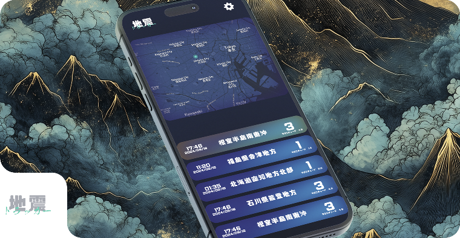

     
    <h1>地震トラッカー Earthquake Tracker</h1>
    

        <b>Presenting earthquake data</b>
    

     
    
     

## Description

This repository contains all the code for the Earthquake Tracker app.
This project is still a work in progress because there are many more functionalities that I want to implement on it after testing, such as Volcano activity and Typhoon tracking.
By finishing this application I was able to improve my Swift and SwiftUI skills.

## Notes
This app/project was only developed for learning purposes.

## Author
Marcelo Bensabath

## License
See LICENSE.

## Acknowledgments
The geological data is provided by the Japan Metereological Agency (JMA).

## Contact
If you have any questions and want to get in touch with me, just [send me an email](mailto:marcelob465@gmail.com)
